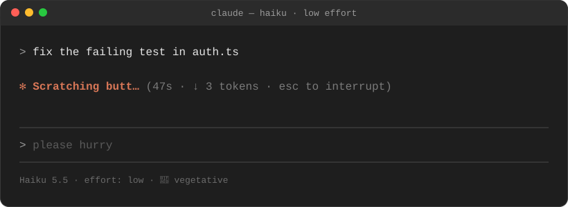
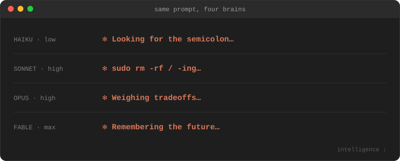

<div align="center">

# 🧠 claude-model-spinners

**Claude Code's "thinking…" spinner now tells you how smart your model really is.**



</div>

## Install (10 seconds)

Paste this into Claude Code:

```
/plugin install model-spinners --marketplace CharlesSS07/claude-model-spinners
```

Press **`y`**, then **Enter**. That's it. It works right away, in every session, no restart needed.

## Same prompt, four brains

<div align="center">

</div>

Your model sets the base tier, and your effort level (`/effort`) bumps it up or down:

| | low | medium | high | xhigh | max |
|---|:-:|:-:|:-:|:-:|:-:|
| **Haiku**  | 🫠 | 🫠 | 🫠 | 🤪 | 🤪 |
| **Sonnet** | 🤪 | 🛹 | 🛹 | 🧐 | 🧐 |
| **Opus**   | 🛹 | 🧐 | 🧐 | 🧙 | 🧙 |
| **Fable**  | 🧙 | 🔮 | 🔮 | 🔮 | 🔮 |

| | Tier | What you'll see |
|:-:|---|---|
| 🫠 | **Vegetative** | *Umm… · Eating paste… · Licking the screen… · Reading the same line for the fourth time… · Spelling "cat" with a K…* |
| 🤪 | **Dim** | *Winging it… · Copy-pasting from Stack Overflow… · Commenting out the failing test… · Hoping…* |
| 🛹 | **Scrappy** | *Goofing around… · Asking codex… · Force-pushing to main… · --no-verify-ing… · Hotfixing prod…* |
| 🧐 | **Thoughtful** | *Deliberating… · Delegating… · Weighing tradeoffs… · Ruminating…* |
| 🧙 | **Sage** | *Grokking… · Steelmanning… · Fixing the bug you haven't found yet…* |
| 🔮 | **Oracular** | *Divining… · Scrying… · Communing with the weights… · Solving it before you asked…* |

**120+ verbs, zero filler.** We kept the best of Claude Code's built-in verbs and sorted each into the pile it deserves. Sonnet got the dance moves (*Moonwalking*, *Sock-hopping*), Opus got *Bloviating* and *Pontificating*, and *Honking* and *Waddling* went exactly where you'd expect. The rest are new, and they're much worse, or much better.

## Got a better one?

Every verb lives in one file: [`hooks/verbs.ts`](hooks/verbs.ts). Open a PR with your best ones and the funniest ones get merged.

## Uninstall

```
/plugin uninstall model-spinners
```

<details>
<summary><b>How it works / hacking on it</b></summary>

It's a Claude Code function-hooks plugin with two small hooks:

- `turn.step` records which effort level your main session is using.
- `ui.render` on the `Spinner` component swaps in a verb from your tier's pile. The pick is seeded by the word Claude Code chose, so it stays the same for a whole turn and changes on the next one.

```sh
git clone https://github.com/CharlesSS07/claude-model-spinners
claude --plugin-dir ./claude-model-spinners    # try your local copy
claude plugin test ./claude-model-spinners     # run the tests
```

Known quirk: Claude Code doesn't reveal the effort level until the first model request, so the very first spinner of a session assumes medium.

</details>

---

<div align="center">

**If your spinner made you laugh, ⭐ star the repo** so your friends' Haikus can scratch their butts too.

Made by [Charles Strauss](https://github.com/CharlesSS07) ([@charles07_s](https://x.com/charles07_s)), an ML researcher working on AI safety & interpretability.<br>
<sub>MIT · built with an Opus that was <i>Deliberating…</i></sub>

</div>
